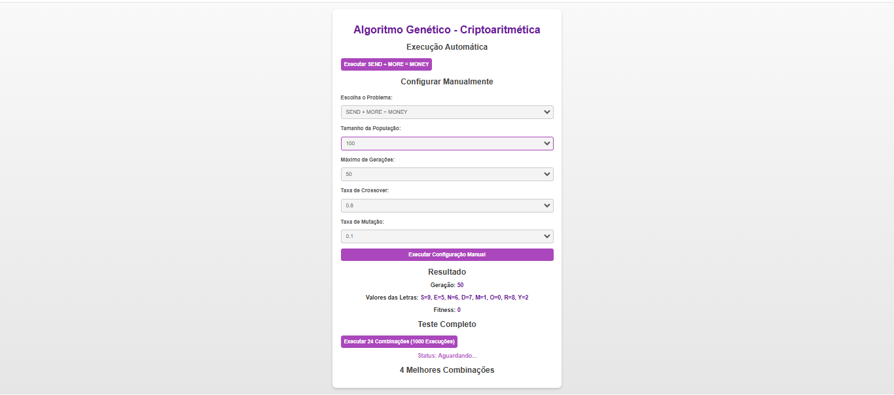
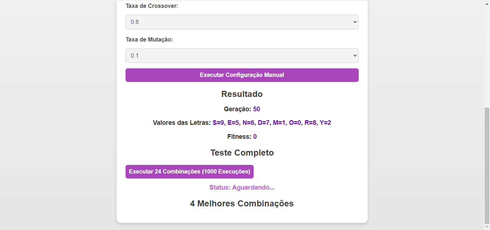

<h1 align="center">Algoritmo Genético</h1>

## Project
This project implements a Genetic Algorithm to solve cryptarithm problems, focusing on finding numerical combinations that satisfy equations such as SEND + MORE = MONEY. The system allows:

Features:
- *Automatic Execution:* Test the default problem (SEND + MORE = MONEY) with predefined parameters.
- *Manual Configuration:* Enable users to configure parameters such as crossover rate, mutation rate, and select different problems.
- *Comprehensive Testing:* Execute all 24 possible parameter combinations, performing 1000 runs for each configuration, totaling 24,000 executions, while collecting performance metrics (success rate and average runtime).


The project also displays the top 4 parameter combinations based on the results on the frontend and exports a complete report in CSV format containing all execution data.
## Layout
<div align="center">
  
  
</div>

## Technologies Used
- *Programming Language:* JavaScript - Backend / HTML - Frontend
- *Development Environment:* Visual Studio Code

## Code Author
```kotlin
fun main() {
    println("Code by Marcela Geremias!")
}